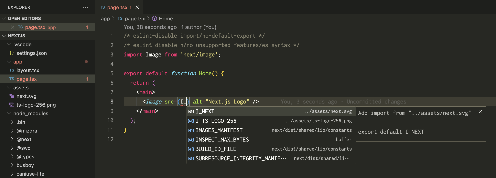
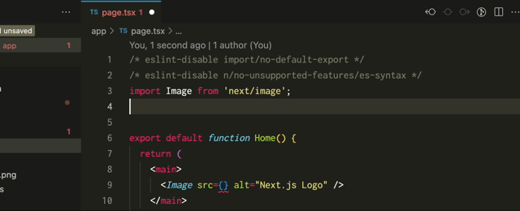
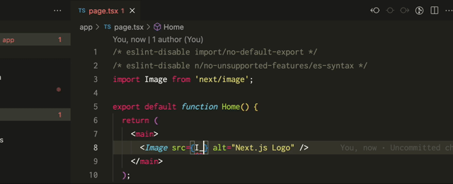

# @mizdra/typescript-plugin-asset

TypeScript language service plugin supporting for importing assets.



## Motivation

In web front-end development, you often type asset import statements. However, asset import statements are not completed in the editor, which makes typing them difficult.



This plugin solves this problem by providing completion for asset import statements.



## Installation

```console
$ npm install -D @mizdra/typescript-plugin-asset
```

## How to setup

To use this plugin, you need to follow three steps.

1. Write the plugin configuration in `tsconfig.json`
2. Configure your editor to use the TypeScript language service plugin

### Write the plugin configuration in `tsconfig.json`

Add the following configuration to `tsconfig.json`. See [Available options](#available-options) for details.

```json
// tsconfig.json
{
  "compilerOptions": {
    // ...
    "plugins": [
      {
        "name": "@mizdra/typescript-plugin-asset",
        "include": ["assets/**/*"],
        "extensions": [".png", ".jpg", ".svg"],
        "exportedNameCase": "constantCase",
        "exportedNamePrefix": "I_"
      }
    ]
  }
}
```

### Configure your VS Code to use the TypeScript language service plugin

> **Warning**
> This section can be skipped by users using editors other than visual studio code.

VS Code [cannot load plugins by default](https://github.com/microsoft/TypeScript/wiki/Writing-a-Language-Service-Plugin#testing-locally). Therefore, special operations are required.

Specifically, you have to do two operations:

1. Run the "TypeScript: Select TypeScript Version" command
2. Choose "Use Workspace Version"

Also, although this is optional, the following settings can be added to `.vscode/settings.json` to prompt other team members to change the above settings.

```json
// .vscode/settings.json
{
  "typescript.tsdk": "node_modules/typescript/lib",
  "typescript.enablePromptUseWorkspaceTsdk": true
}
```

## Available options

### `include` (required)

Glob pattern of assets. `@mizdra/typescript-plugin-asset` completes import statements only for assets matching this pattern.

- Type: `string[]`
- Example: `["assets/**/*"]`

### `exclude`

Glob pattern of assets to exclude. `@mizdra/typescript-plugin-asset` does not complete import statements for assets matching this pattern.

### `extensions` (required)

File extensions of assets. `@mizdra/typescript-plugin-asset` completes import statements only for assets matching this extensions.

- Type: `string[]`
- Example: `[".png", ".jpg", ".svg"]`

### `exportedNameCase`

The name case of default export in asset module.

- Type: `"constantCase" | "camelCase" | "pascalCase" | "snakeCase"`
- Default: `"constantCase"`

### `exportedNamePrefix`

The name prefix of the default export of the asset module. Must be a valid JavaScript identifier.

- Type: `string`
- Default: `"I_"`
